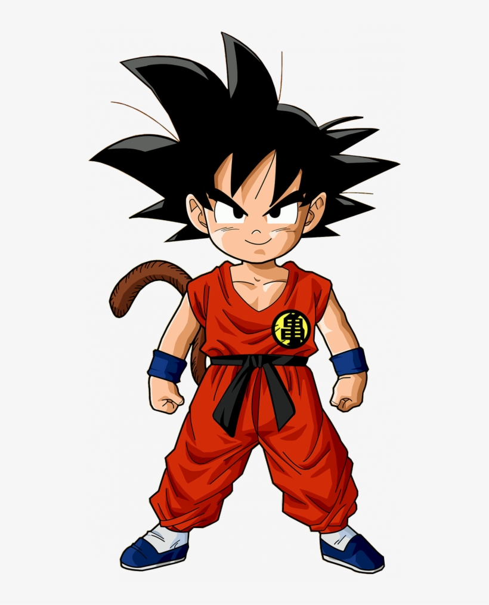
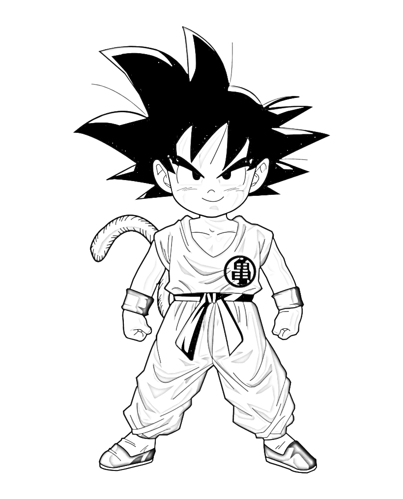

<h1 style=bold>Chitra 🔰</h1>
- A Photo to Sketch Converter App using Python

# Features ✨
- Artifical Work
- 80% Accurate Sketch (Vary Detailing)
- Runs Offline
- Simple Coding
- Direct Installation
- Simple Interface
- Custom Sketch Name
- Choose as per Choice
- Free with No Issues

# Requirements 📂
- Python🐍
- Any Windows or Linux OS💻
- Coffee With Good Mood☕
- A Picture for Sketching🖼️

# Installation ⬇️
- In Llinux git clone https://www.github.com/WhiteHat-Hunter/Chitra  OR  Download as zip in windows
- cd folder_name
- In CMD/Terminal Type:pip install -r modules.txt
- chmod +x main.py (only for linux)

# Usage 👨‍💻
- python main.py  OR  python3 main.py

#Very Imp 🔴
- First, Check all modules installed or not
- Give full path with image name & extension of photo where it is stored
- While Save, give proper path and name with extension to save
- Don't try photo containing any improper extension like: .gif, .webp, etc
- Don't give more than 10 mb sized photo

# Samples

- Before

- After

--------------------------------------------------------------------------------------------------------------------

<h2>Coded with Pure ❤️ of Siddhesh</h2>

Thankyou For Downloading & Using!!

--------------------------------------------------------------------------------------------------------------------

# Contact Me
- Whatsapp: +919172814140
- Instagram: www.instagram.com/ft.siddhesh
- LinkedIn: www.linkedin.com/in/siddhesh-surve-785387231
- Github: www.github.com/WhiteHat-Hunter

## Copyright
- GitHub : Mr.Siddhesh ©️
